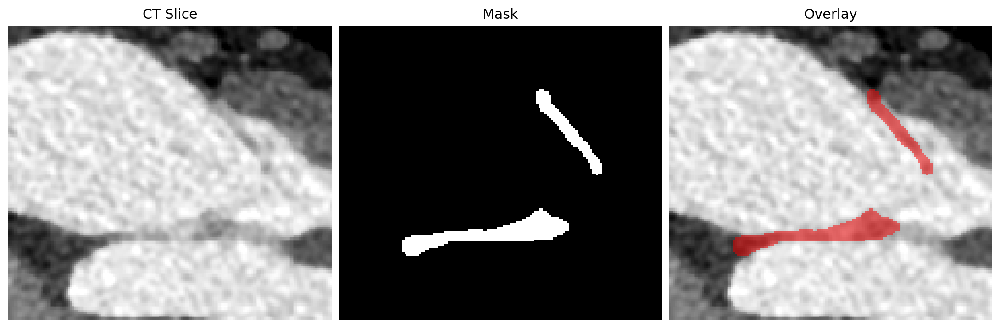
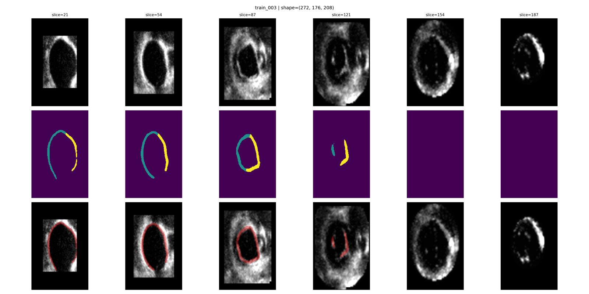
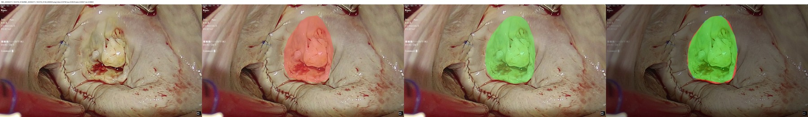

# MVAA Baseline

This folder contains baseline code for all three MVAA tasks.

## Task Visualizations

### Task 1. Cardiac CT Analysis



### Task 2. 3D TEE Segmentation



### Task 3. Surgical Frame Detection



## 1. Folder Layout

```text
baseline/
  README.md
  requirements.txt
  .gitignore
  task1/
    train.py
    generate_task1_predictions.py
    dataset.py
    model_factory.py
    utils.py
  task2/
    train.py
    generate_task2_predictions.py
    dataset.py
    model_factory.py
    utils.py
  task3/
    train.py
    generate_task3_predictions.py
    dataset.py
    model_factory.py
    utils.py
```

## 2. Environment

```bash
cd baseline
pip install -r requirements.txt
```

Recommended: Python 3.9+ with CUDA-enabled PyTorch.

### Path Note (Baseline and Data Released Separately)

In many participant environments, the `baseline/` folder and dataset package are placed in different directories.

- Do not rely on default relative paths in scripts unless your local layout matches exactly.
- For training scripts, always pass explicit dataset paths via CLI arguments.
- For prediction scripts, edit the constants under `# ===== Config (edit here) =====` first.

## 3. Training Quick Start

```bash
# Task 1
cd baseline/task1
python train.py \
  --data-root /path/to/mvaa_data/t1_ct \
  --output-dir runs/semi_supervised

# Task 2
cd baseline/task2
python train.py \
  --data-dir /path/to/mvaa_data/t2_tee/train \
  --output-dir runs/full_supervised2

# Task 3
cd baseline/task3
python train.py \
  --labeled-root /path/to/mvaa_data/t3_vid/train \
  --unlabeled-root /path/to/task3_unlabeled/images \
  --output-dir runs/semi_baseline_default
```

## 4. Prediction Quick Start

```bash
# Task 1
cd baseline/task1
# edit CKPT_PATH / DATA_DIR / OUTPUT_JSON in script first
python generate_task1_predictions.py

# Task 2
cd baseline/task2
# edit CKPT_PATH / DATA_DIR / OUTPUT_JSON in script first
python generate_task2_predictions.py

# Task 3
cd baseline/task3
# edit CKPT_PATH / DATA_DIR / VIDEO_FOLDERS / OUTPUT_JSON in script first
python generate_task3_predictions.py
```

## 5. Where to Modify Paths

### Task 1

Training path arguments (`task1/train.py`, CLI):

- `--data-root` (default: `data`)
- `--output-dir` (default: `runs/semi_supervised`)

Example:

```bash
python train.py --data-root /path/to/task1/data --output-dir /path/to/task1/runs
```

Prediction path constants (`task1/generate_task1_predictions.py`, edit in `# ===== Config (edit here) =====`):

- `CKPT_PATH`
- `DATA_DIR`
- `SUBMISSION_TASK_DIR`
- `PRED_DIR`
- `OUTPUT_JSON`

Default prediction paths are repo-relative:

- checkpoint: `baseline/task1/runs/semi_supervised/checkpoints/best_model.pt`
- validation images: `data/t1_ct/val/images`

Task1 default submission output:

- `baseline/submission/t1_ct/`
  - `task1_predictions.json`
  - `*.nii.gz` prediction masks

### Task 2

Training path arguments (`task2/train.py`, CLI):

- `--data-dir` (default: `train`)
- `--output-dir` (default: `runs/full_supervised2`)

Example:

```bash
python train.py --data-dir /path/to/task2/train --output-dir /path/to/task2/runs
```

Prediction path constants (`task2/generate_task2_predictions.py`, edit in `# ===== Config (edit here) =====`):

- `CKPT_PATH`
- `DATA_DIR`
- `SUBMISSION_TASK_DIR`
- `PRED_DIR`
- `OUTPUT_JSON`

Default prediction paths are repo-relative:

- checkpoint: `baseline/task2/runs/full_supervised2/checkpoints/best_model.pt`
- validation images: `data/t2_tee/val/images`

Task2 default submission output:

- `baseline/submission/t2_tee/`
  - `task2_predictions.json`
  - `*.nii.gz` prediction masks

### Task 3

Training path arguments (`task3/train.py`, CLI):

- `--labeled-root`
- `--unlabeled-root`
- `--output-dir`
- `--external-val-root` (only used if `--use-external-val`)

Example:

```bash
python train.py \
  --labeled-root /path/to/task3/labeled/train_pool \
  --unlabeled-root /path/to/task3/unlabeled/images \
  --output-dir /path/to/task3/runs
```

Prediction path constants (`task3/generate_task3_predictions.py`, edit in `# ===== Config (edit here) =====`):

- `CKPT_PATH`
- `DATA_DIR`
- `VIDEO_FOLDERS`
- `SUBMISSION_TASK_DIR`
- `PRED_DIR`
- `OUTPUT_JSON`
- `DEVICE`

Default prediction paths are repo-relative:

- checkpoint: `baseline/task3/runs/semi_baseline_default/checkpoints/best.pt`
- validation images: `data/t3_vid/val/images`

`VIDEO_FOLDERS = []` means infer all folders/images under `DATA_DIR`.

Task3 default submission output:

- `baseline/submission/t3_vid/`
  - `task3_predictions.json`
  - `**/*_label_bin.png` prediction masks

## 6. Task3 Label Format Note

Task3 training supports labels stored in tar files (`*_png_Label.tar`) and reads binary masks internally using `target_label` (default `10`).

For inference, `generate_task3_predictions.py` writes per-image binary label PNGs named `*_label_bin.png` and exports `task3_predictions.json`.

## 7. Submission JSON Format (Required)

Each task JSON must provide a `cases` list. Minimal example:

```json
{
  "cases": [
    { "case_id": "0001", "segmentation": "0001-pred.nii.gz" }
  ]
}
```

Only these fields are required for evaluation:

- `case_id`
- `segmentation` (path relative to that task folder in submission zip)

## 8. Default Outputs

Each task writes training outputs under its default `runs/...` folder, including:

- log file (`train.log`)
- epoch history (`history.csv`)
- checkpoints (`checkpoints/`)
- summary metrics (`*.json`)

Prediction scripts save directly into `baseline/submission/`:

- `baseline/submission/t1_ct/`
- `baseline/submission/t2_tee/`
- `baseline/submission/t3_vid/`

Zip the `submission` folder contents (three task folders) for upload.

## 9. Submission Zip Structure (Must Match Baseline Reference)

Your final zip should follow the same layout as:

- `/home/ubuntu/db/MVAA/baseline/submission.zip`

Important:

- The zip root must directly contain `t1_ct/`, `t2_tee/`, `t3_vid/`.
- Do not include an extra parent directory such as `baseline/` or `submission/` in the zip root.
- Each task folder must include its `task*_predictions.json`.
- Task3 masks should keep video subfolders and use `*_label_bin.png` names.

Expected structure:

```text
submission.zip
  t1_ct/
    task1_predictions.json
    *.nii.gz
  t2_tee/
    task2_predictions.json
    *.nii.gz
  t3_vid/
    task3_predictions.json
    <video_folder_1>/
      *_label_bin.png
    <video_folder_2>/
      *_label_bin.png
    ...
```

Recommended packaging command:

```bash
cd baseline/submission
zip -r ../submission.zip t1_ct t2_tee t3_vid
```

Quick structure check:

```bash
unzip -l /home/ubuntu/db/MVAA/baseline/submission.zip
unzip -l /path/to/your/submission.zip
```
